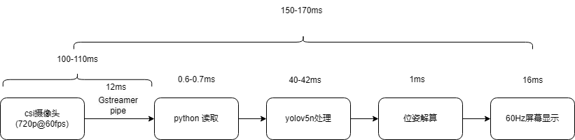
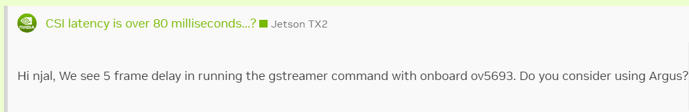
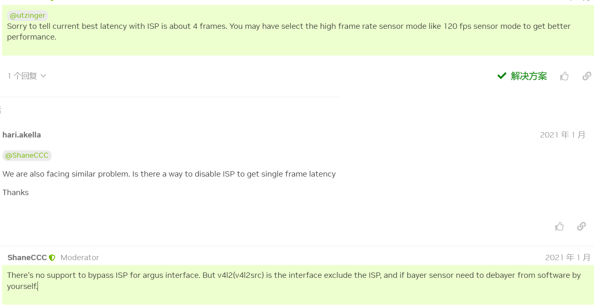
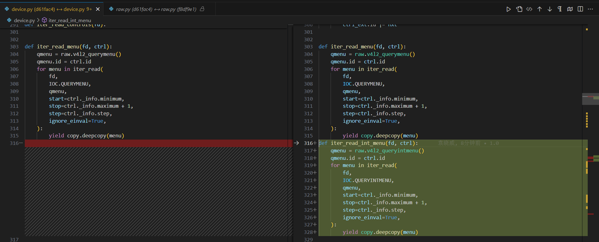
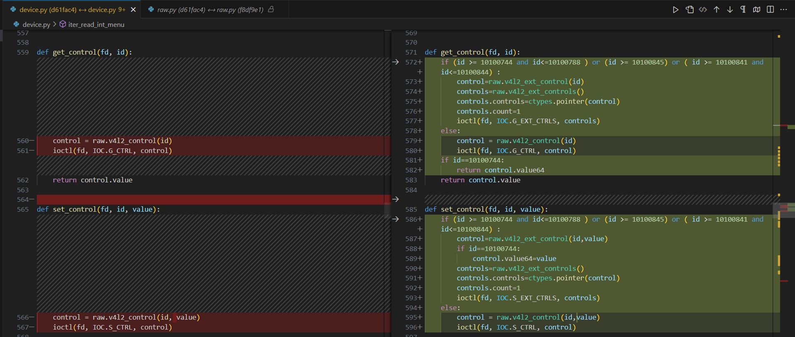
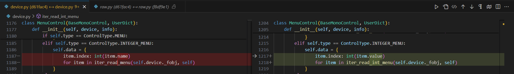
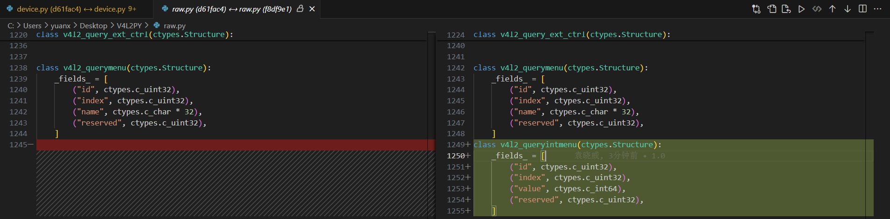
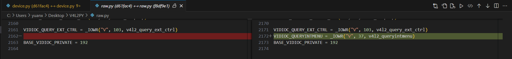

# 单目视觉测距

目前进度为Detect_Tag_no_opencv.py

移除opencv的轮廓检测部分，增加csi摄像头支持，暂时修改回串行

将程序分为以下三个部分：

* [Detect_Tag_no_opencv.py](Detect_Tag_no_opencv.py)(程序主体)
* [file_test.py](file_test.py)(进行精度测试)
* [Tagwork/Tagsolve.py](Tagwork/Tagsolve.py)(负责从识别框解算位置姿态)
* [Tagwork/Tagworker.py](Tagwork/Tagworker.py)(负责从读取图片到输出识别框)
* [cameratest/readv4l2.py](cameratest/readv4l2.py)(v4l2直接读取测试)
* [cameratest/run_calib_RGB.py](cameratest/run_calib_RGB.py)(棋盘格矫正相机内参)

## Camera Latency

使用csi摄像头时延时依然很大，检测Gstreamer pipe耗时仅在7-12ms左右

发现官方论坛中有说明使用gstreamer的命令会有不可避免的5帧缓冲，60fps下大约为80ms的延时，与测试结果相符，这样一来就能解释为何会有如此大的摄像头延时了

根据官方说明，下一步可以尝试使用[argus](https://docs.nvidia.com/jetson/l4t-multimedia/group__LibargusAPI.html)？

> Libargus is designed to address a number of fundamental requirements:
>
> * Support for a wide variety of use cases (traditional photography, computational photography, video, computer vision, and other application areas.) To this end, libargus is a frame-based API; every capture is triggered by an explicit request that specifies exactly how the capture is to be performed.
> * Support for multiple platforms, including L4T and Android.
> * Efficient and simple integration into applications and larger frameworks. In support of this, libargus delivers images with EGLStreams, which are directly supported by other system components such as OpenGL and Cuda, and which ***require no buffer copies during delivery to the consumer***.
> * Expansive metadata along with each output image.
> * Support for multiple sensors, including both separate control over independent sensors and access to synchronized multi-sensor configurations. (The latter are unsupported in the current release. When support is added, it will be available on only some NVIDIA platforms.)
> * Version stability and extensibility, which are provided by unchanging virtual interfaces and the ability for vendors to add specialized extension interfaces.

坏消息 nvarguscamerasrc 已经时使用了argus，看来要试试通过v4l2来绕过这个板载ISP的4帧缓存，或者使用120fps的摄像机来获得更低的延时

又一个坏消息，jetson自带的gstreamer版本过低，v4l2src不支持10bit的bayer格式，需要自己编译一个重新安装，参照[这个](https://docs.nvidia.com/jetson/archives/r35.3.1/DeveloperGuide/text/SD/Multimedia/AcceleratedGstreamer.html#gstreamer-build-instructions)

nvidia的官方教程是1.16.2版本的，[1.24.1版本](https://github.com/GStreamer/gstreamer)已经开始用meson构建了

下载最新版本的gstreamer及其gst-plugins-base-1.24.1、gst-plugins-good-1.24.1并安装后，v4l2src支持rggb10le

首先 v4l2-ctrl --bypass_mode=0 绕过板载ISP

但是读取到的都是全白画面，不知道为什么

使用v4l2py库，用python读取摄像头,发现设备初始化出错,通过报错信息发现是该库在进行[querymenu](https://www.kernel.org/doc/html/v4.10/media/uapi/v4l/vidioc-queryctrl.html#v4l2-querymenu)操作时没有对IntegerMenu类型的控制项正确处理，以及在G_CTRL操作时没有对[EXT_CTRLS](https://www.kernel.org/doc/html/v4.10/media/uapi/v4l/vidioc-g-ext-ctrls.html)进行正确的处理，需要修改源码

### device.py

### raw.py

### 暂时停止对摄像头的研究

直接处理4k图像耗时太长，延时反而大了，暂时放弃
