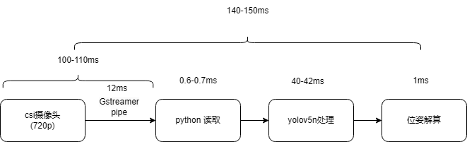

# 单目视觉测距

目前进度为Detect_Tag_no_opencv.py

移除opencv的轮廓检测部分，增加csi摄像头支持，暂时修改回串行

将程序分为以下三个部分：

* [Detect_Tag_no_opencv.py](Detect_Tag_no_opencv.py)(程序主体)
* [Tagsolve.py](Tagsolve.py)(负责从识别框解算位置姿态)
* [Tagworker.py](Tagworker.py)(负责从读取图片到输出识别框)

# Camera Latency

使用csi摄像头时延时依然很大

发现官方论坛中有说明使用gstreamer的命令会有不可避免的5帧缓冲，60fps下大约为80ms的延时，与测试结果相符，这样一来就能解释为何会有如此大的摄像头延时了

根据官方说明，下一步可以尝试使用[argus](https://docs.nvidia.com/jetson/l4t-multimedia/group__LibargusAPI.html)？
